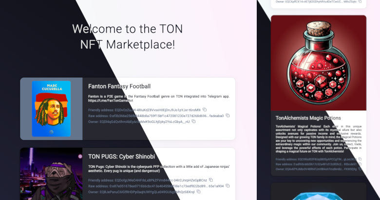

# TON NFT Marketplace


## 🚀 Running the Project in Development Mode

### Installing dependencies

Link to the guide for installing Node Version Manager (nvm).

https://github.com/nvm-sh/nvm?tab=readme-ov-file#installing-and-updating

```shell
nvm install
npm install -g yarn
yarn install
```

For Telegram integration using the Login Widget Button or a Telegram Web App, an HTTPS connection is required. We already have a Fast Reverse Proxy Server (frps) running, and configuration is in the `frpc.toml` file. All that’s left is to install the Fast Reverse Proxy Client (frpc) to enable HTTPS access to the service for local development

https://github.com/fatedier/frp


```sh
brew install frpc
```

### Setup secrets

Secrets required for local development are stored in the .env.secrets file. You may decrypt it or create your own version using .env.secrets as a template.

```sh
brew install sops gpg
sops --decrypt --input-type dotenv --output-type dotenv .env.secrets > .env.secrets.decrypted
```

### Starting proxy

```shell
yarn proxy
```

### Starting services

```shell
yarn dev
```

Telegram Login Widget: https://team-dev.tgmbot.com/

Telegram Web App: https://t.me/tgm_com_bot/team

> This may not be a perfect one-line guide, but these additional tools help improve the DevEx. 

## ► Useful commands

Verification Command

```shell
yarn verify
```

TypeScript Type Generation for *.graphql Files

```shell
yarn codegen
```

Run the build of services to ensure the application deployment will be successful.

```shell
yarn build
```

Run the build of services to ensure the application deployment will be successful.

```shell
yarn build
```

Execute the Docker images build process.

```sh
docker buildx bake --load api client
```


## 🎬 Demo

[Telegram Login Widget](https://demo.tgmbot.com/)

[Telegram Web App](https://t.me/demo_tgm_bot/ton_nft_marketplace)

The application is optimized for both mobile and desktop devices and also supports dark mode.




## 🔗 Links

[TS Product: take-home assignment](https://ton-org.notion.site/TS-Product-take-home-assignment-1745274bd2cf80689ec0dec263902ac8)

[Cloned TS Product: take-home assignment](https://www.notion.so/TS-Product-take-home-assignment-1759f219b7868030b0a2ceebd2285d8d)

[Repository on GitHub](https://github.com/yevgeniy-shkolyar/ton-nft-marketplace)

[Original repository on GitLab](https://gitlab.com/tgmbot/ton-nft)


## 💬 Comments

> I couldn't achieve a consistent order for the lists without sorting, so I set the order by the "NFT Friendly Address" field.


## 📧 Contacts

If you have any questions, I will be glad to answer.

https://t.me/eshkolyar
